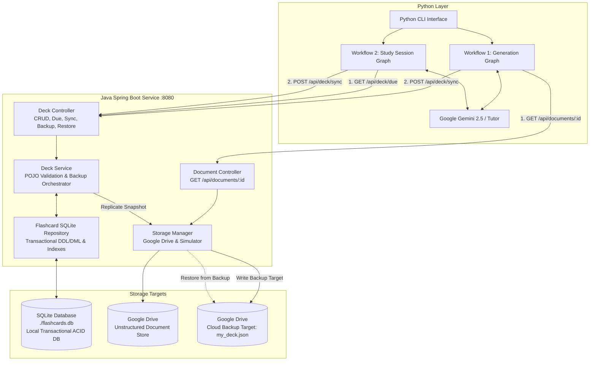

# Polyglot Flashcard System (Python + Java + SQLite + Google Drive)

A production-grade, distributed flashcard learning system implementing a standard **Local-First Architectural Pattern**:
- **Presentation Layer (Python CLI)**: Interactive command-line interface with spaced-repetition study sessions, progress metrics, and storage/backup management.
- **Processing Layer (Python & LangGraph)**: AI state machines utilizing **LangGraph** and **Google Gemini** for automated card generation, review, and dynamic spaced-repetition evaluation.
- **Local Transactional Database (SQLite)**: High-speed, embedded relational database (`./flashcards.db`) providing ACID consistency, sub-millisecond study session queries, and indexed due-date filtering (`WHERE next_review_date <= today`).
- **Unstructured Document Store (Google Drive)**: Cloud object store housing raw unstructured documents (notes, Markdown files, PDFs, Google Docs) consumed by the LangGraph card generation pipeline.
- **Backup Target & Replication Sink (Google Drive)**: Cloud target receiving automated deck snapshots on sync, supporting on-demand backup (`POST /api/deck/backup`) and disaster-recovery restoration (`POST /api/deck/restore`).
- **Storage Layer (Java Data Service - Maven & Spring Boot)**: Strict REST guardian orchestrating SQLite transactional operations and Google Drive cloud integrations.

> 📖 **New User?** Read the step-by-step [User Guide (USER_GUIDE.md)](file:///c:/dev/source/2026/flashcard-system/USER_GUIDE.md) for full menu walkthroughs and operational commands.

---

## Architecture Overview



---

## The Architectural Pattern: Local-First DB + Cloud Document & Backup Store

| Architectural Role | Technology | Purpose & Guarantees |
|---|---|---|
| **Local Transactional DB** | **SQLite** (`./flashcards.db`) | **ACID Transactions & Ultra-low Latency**: Flashcard updates, Leitner box progressions, and study session filtering happen locally in sub-milliseconds without cloud latency or rate limits. |
| **Unstructured Document Store** | **Google Drive** (`/documents`) | **Scalable Document Management**: Holds source documents (Markdown, text, notes, Google Docs) for LangGraph AI extraction. |
| **Backup Target** | **Google Drive** (`my_deck.json`) | **Durability & Cross-Device Sync**: Replicates deck snapshots on sync, guards against local disk failure, and supports complete database restoration. |

---

## Strict API & Data Contract

| HTTP Method | Endpoint | Description |
|---|---|---|
| `GET` | `/api/documents/{id}` | Fetches raw document text from Google Drive unstructured document store |
| `GET` | `/api/deck/due` | Queries SQLite using SQL index on `next_review_date` for cards due today or earlier |
| `POST` | `/api/deck/sync` | Atomically batch-upserts cards into SQLite and replicates backup to Google Drive |
| `GET` | `/api/deck` | Retrieves full master deck from SQLite with Leitner statistics |
| `POST` | `/api/deck/backup` | Manually triggers export of SQLite state to Google Drive backup target |
| `POST` | `/api/deck/restore` | Restores local SQLite database from Google Drive backup target |
| `GET` | `/api/deck/status` | Returns storage telemetry (database engine, file path, card count, cloud status) |

---

## Workflows

### Workflow 1: The "Generation" Graph
1. **Retrieve Node (Python -> Java)**: Python sends `GET /api/documents/{id}`. Java fetches the raw unstructured document from Google Drive (or local drive simulator).
2. **Generate Node (Python)**: LangGraph + Gemini process the text into draft conceptual flashcards.
3. **Review Node (Python)**: Draft cards are reviewed and polished for clarity.
4. **Save Node (Python -> Java)**: Python posts approved cards via `POST /api/deck/sync`.
5. **Transactional Sync (Java)**: Java batch-upserts cards into SQLite within an ACID transaction and updates the Google Drive backup snapshot.

### Workflow 2: The "Study Session" Graph
1. **Initialize Node (Python -> Java)**: Python requests due cards via `GET /api/deck/due`.
2. **Indexed Query (Java)**: SQLite instantly queries cards with `next_review_date <= LocalDate.now()`.
3. **Study Loop (Python)**:
   - **Select Node**: Picks the next due card.
   - **Interactive Node**: Displays card question and prompts user for answer.
   - **Evaluate Node**: Gemini evaluates correctness, feedback, and Leitner box progression (Boxes 1 to 5).
4. **Sync Node (Python -> Java)**: Posts reviewed cards via `POST /api/deck/sync`.
5. **Commit & Replicate (Java)**: Java saves updated box numbers and review intervals into SQLite and replicates to Google Drive.

---

## Quick Start Guide

### Prerequisites
- Java 17+ (e.g. OpenJDK 25 / 21 / 17)
- Maven 3.6+
- Python 3.10+ (with virtual environment at `python-client/venv`)

### 1. Start Java Data Service
```powershell
.\start_java_service.ps1
```
*Or manually via Maven:*
```powershell
cd java-data-service
mvn spring-boot:run
```
The service will start on `http://localhost:8080`.

### 2. Launch Python CLI
In a separate terminal:
```powershell
.\run_cli.ps1
```
*Or manually:*
```powershell
cd python-client
.\venv\Scripts\python.exe app\cli.py
```

### 3. Run Automated Verification Tests
```powershell
# Run Java unit tests (SQLite schema, transactions, due query index, backup/restore)
mvn -f java-data-service\pom.xml test

# Run End-to-End Integration test (Full cycle against running service)
.\python-client\venv\Scripts\python.exe python-client\app\test_e2e.py
```

---

## Configuration

### SQLite Configuration
By default, the SQLite database is created at `./flashcards.db`. You can configure this via `java-data-service/src/main/resources/application.properties` or environment variables:
```properties
sqlite.db.path=./flashcards.db
spring.datasource.url=jdbc:sqlite:${SQLITE_DB_PATH:./flashcards.db}
backup.auto-sync=true
```

### Google Drive Integration (Optional)
By default, the Java service runs in **zero-config local simulated mode**, storing unstructured documents in `./drive_store/documents/` and backup snapshots in `./drive_store/my_deck.json`.

To connect to live Google Drive:
1. Place your Google Cloud service account JSON or OAuth client credentials file at `java-data-service/credentials.json`.
2. In `java-data-service/src/main/resources/application.properties` (or environment variables):
   ```properties
   google.drive.enabled=true
   google.drive.credentials-path=./credentials.json
   ```

### Google Gemini API Key (Optional)
1. Copy `python-client/.env.example` to `python-client/.env`.
2. Add your key:
   ```env
   GEMINI_API_KEY=your_actual_api_key_here
   GEMINI_MODEL=gemini-2.5-flash
   ```
*(If omitted, an intelligent built-in tutor simulator handles card generation and answer grading automatically).*
