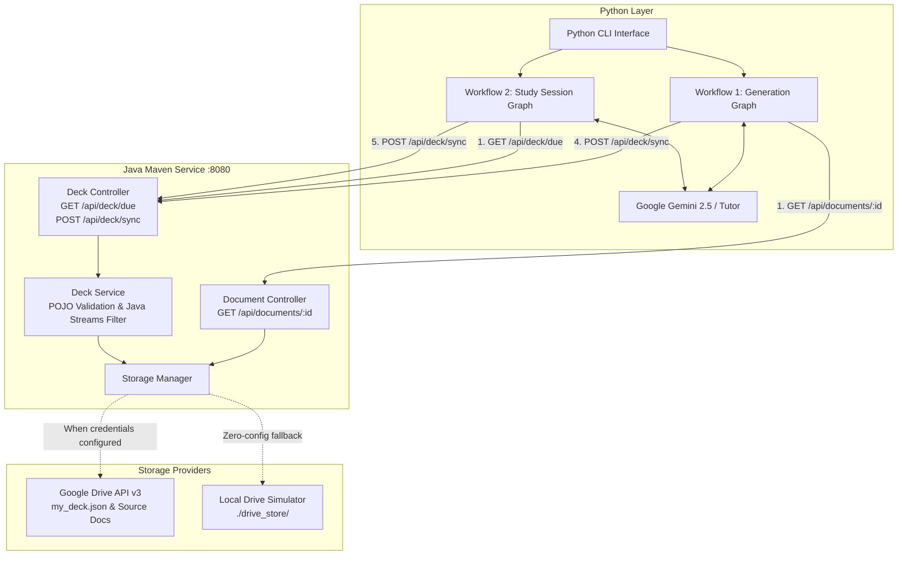

# Polyglot Flashcard System (Python + Java + Google Drive)

A production-grade, distributed flashcard learning system implementing a clean **Polyglot Design**:
- **Presentation Layer (Python CLI)**: Command-line interface with interactive study sessions, progress statistics, and Leitner box distributions.
- **Processing Layer (Python & LangGraph)**: AI state machines utilizing **LangGraph** and **Google Gemini** for automated card generation, review, and dynamic spaced-repetition evaluation.
- **Storage Layer (Java Data Service - Maven & Spring Boot)**: Lightweight Spring Boot REST application serving as the strict guardian for **Google Drive** storage, POJO-enforced schema validation, and Java Stream-based due card filtering.

---

## Architecture Overview



---

## Strict API & Data Contract

| HTTP Method | Endpoint | Description |
|---|---|---|
| `GET` | `/api/documents/{id}` | Returns document raw text for the generation graph |
| `GET` | `/api/deck/due` | Uses Java Streams to filter cards where `next_review_date <= today` |
| `POST` | `/api/deck/sync` | Reconciles incoming updated cards into master `my_deck.json` POJO |
| `GET` | `/api/deck` | Returns entire master deck with Leitner statistics |

---

## Workflows

### Workflow 1: The "Generation" Graph
1. **Retrieve Node (Python -> Java)**: Python sends `GET /api/documents/{id}`. Java connects to Google Drive / drive store, extracts raw text, and returns it.
2. **Generate Node (Python)**: LangGraph + Gemini process raw text into draft conceptual flashcards.
3. **Review Node (Python)**: Draft cards are reviewed and polished for clarity and conciseness.
4. **Save Node (Python -> Java)**: Python posts approved `final_cards` to Java (`POST /api/deck/sync`).
5. **Sync (Java)**: Java maps the new cards into strict `Flashcard` POJOs, merges them into `Deck`, and updates Google Drive.

### Workflow 2: The "Study Session" Graph
1. **Initialize Node (Python -> Java)**: Python requests due cards via `GET /api/deck/due`.
2. **Filter Logic (Java)**: Java streams filter cards with `next_review_date <= LocalDate.now()`.
3. **Study Loop (Python)**:
   - **Select Node**: Picks the next due card.
   - **Human-in-the-Loop Node**: Displays question and prompts student for answer.
   - **Evaluate Node**: Gemini evaluates correctness, assigns feedback, and adjusts the Leitner `box_number`:
     - *Correct*: Card advances to next box (up to Box 5) with exponential review interval (1, 3, 7, 14, 30 days).
     - *Incorrect*: Card resets to Box 1 for immediate review tomorrow.
4. **Sync Node (Python -> Java)**: Once session ends, Python posts updated cards via `POST /api/deck/sync`.
5. **Reconciliation (Java)**: Java updates the master deck in memory with progress stats and writes the file to Google Drive.

---

## Quick Start Guide

### Prerequisites
- Java 17+ (e.g. OpenJDK 25 / 21 / 17)
- Maven 3.6+
- Python 3.10+ (with virtual environment at `python-client/venv`)

### 1. Start Java Data Service
```powershell
.\start_java_service.ps1
```
*Or manually via Maven:*
```powershell
cd java-data-service
mvn spring-boot:run
```
The service will start on `http://localhost:8080`.

### 2. Launch Python CLI
In a separate terminal:
```powershell
.\run_cli.ps1
```
*Or manually:*
```powershell
cd python-client
.\venv\Scripts\python.exe app\cli.py
```

### 3. Run Automated Tests
```powershell
# Run Java unit tests (Java Stream due filtering & POJO validation)
mvn -f java-data-service\pom.xml test

# Run End-to-End Integration test (Workflow 1 + Workflow 2 against live service)
.\python-client\venv\Scripts\python.exe python-client\app\test_e2e.py
```

---

## Configuration

### Google Drive Integration (Optional)
By default, the Java service runs in **zero-config local simulated mode**, storing `my_deck.json` in `./java-data-service/drive_store/`.

To connect to live Google Drive:
1. Place your Google Cloud service account JSON or OAuth client credentials file at `java-data-service/credentials.json`.
2. In `java-data-service/src/main/resources/application.properties` (or environment variables):
   ```properties
   google.drive.enabled=true
   google.drive.credentials-path=./credentials.json
   ```

### Google Gemini API Key (Optional)
To use live Gemini models for card generation and grading:
1. Copy `python-client/.env.example` to `python-client/.env`.
2. Add your key:
   ```env
   GEMINI_API_KEY=your_actual_api_key_here
   GEMINI_MODEL=gemini-2.5-flash
   ```
*(If omitted, an intelligent built-in tutor simulator handles card generation and answer grading automatically).*
